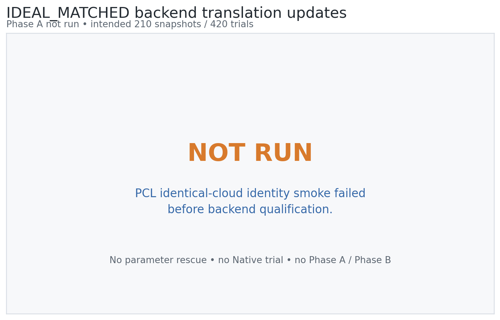
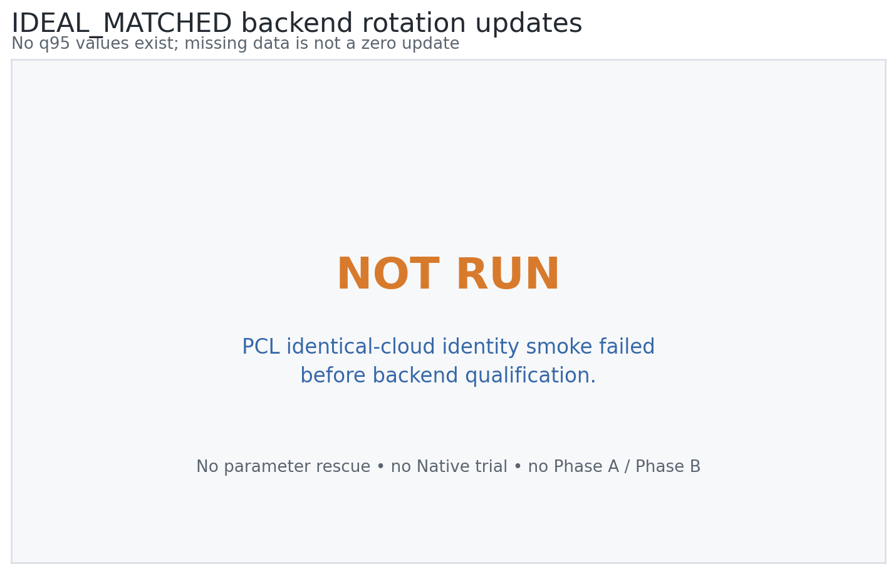
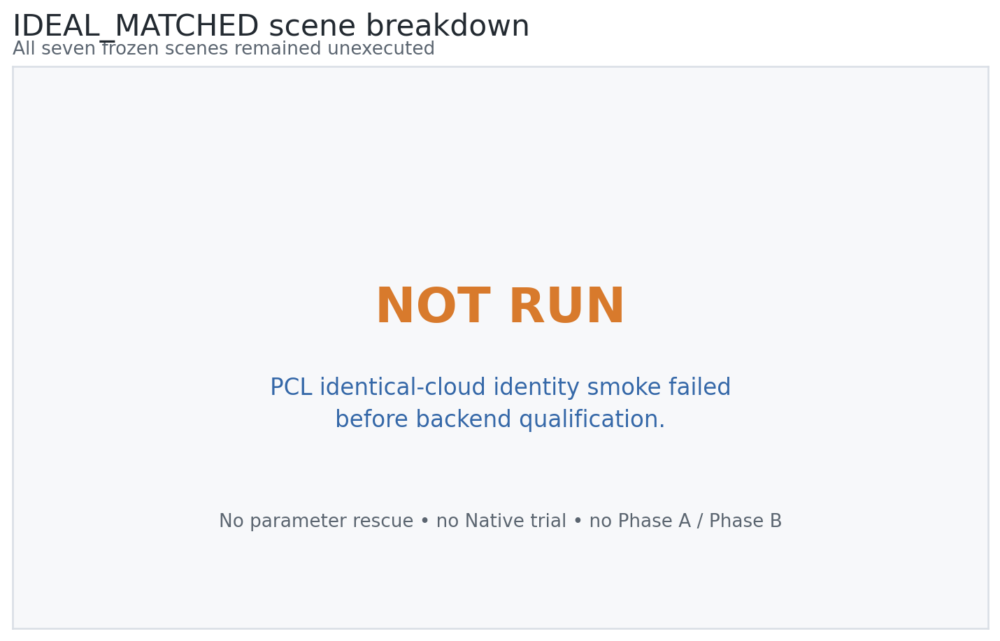
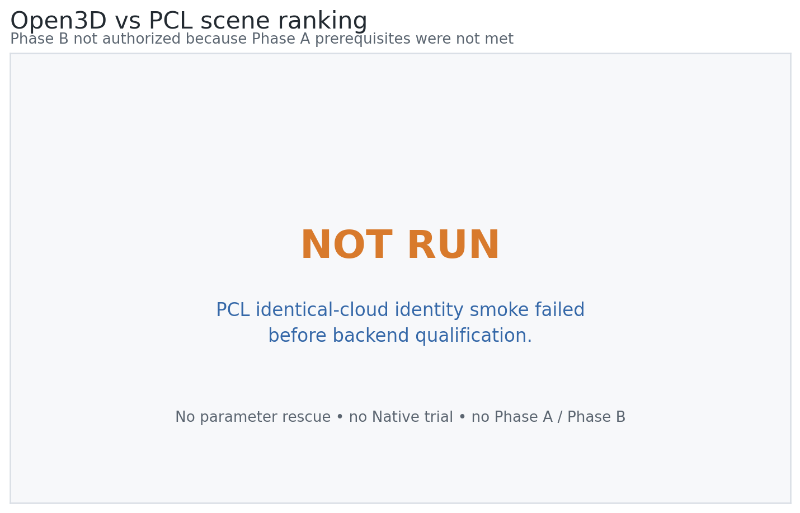
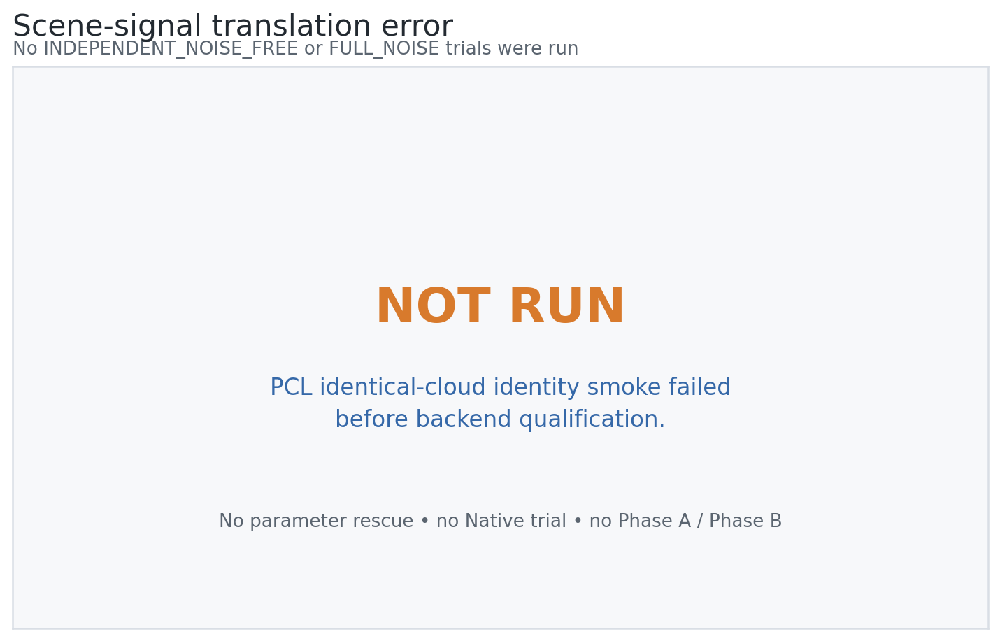

# Open3D vs PCL Independent Backend Qualification

## Technical summary

The audit stopped before qualification data collection. PCL 1.15.1 was
successfully established in the isolated environment and the CLI compiled,
but the prospectively frozen identical-cloud identity smoke returned
`has_converged=false` and `finite_output=false`. The required composite build
gate is therefore false. Phase A, Phase B, full Development, Confirmatory,
real-data validation, and Measurement-paper work were not run or authorized.

## The identity smoke stopped the audit

The build sequence retained both an initial API-name compile error and its
non-parametric correction. Compilation then passed, producing an executable
with SHA-256
`829eacdfc0cc8b3eb1a291c22e5e1af9d4ff4f0c696babec2bf3fcdf97f44aa1`.
The next mandatory gate was the same-cloud identity CTest; it failed 0/1.
Per the locked protocol, this is a terminal backend-build result and cannot be
rescued by changing the fixture, normal settings, ICP settings, or thresholds.

The following required figure surfaces deliberately show that no translation,
rotation, scene, or ranking data exists. They are audit stop cards rather than
quantitative charts and must not be interpreted as zero-valued measurements.

No translation q95 or per-scene median exists because Phase A was not entered.

No rotation q95 exists; the absence of rows is distinct from a zero update.

No scene was removed or selectively retained. All seven remained frozen and
unexecuted after the build gate.

Phase B required two qualified Phase A backends, so no Spearman statistic or
rank comparison was computed.

No weak/rich ratio or scene trend is available from this audit.

## Scope, data, and metric definitions

The intended Phase A grain was one frozen IDEAL_MATCHED snapshot per scene,
Development geometry seed, Development measurement seed, and repeat, shared
by Open3D and PCL. The intended counts were 210 snapshots and 420 trials.
Actual counts are zero because the prerequisite CLI smoke failed. Empty Phase
A and Phase B CSVs contain headers only so downstream readers cannot confuse
missing measurements with zeros.

The identity smoke used identical source and target fixture coordinates and an
identity initial transform. Its failure is a build-qualification observation,
not one of the 420 formal backend trials. The PCL qualification solver-failure
count is therefore zero over zero trials, while the separate identity-smoke
failure count is one.

## Methodology and reproducibility

The protocol was committed and tagged before dependency inspection, PCL
implementation, or execution. PCL ran only in `degen-lio-pcl-backend`; the
Open3D environment was unchanged. CMake, compiler, package, build, CTest, and
executable-hash evidence is saved in the environment report directory.

Native remains excluded by the frozen prior failure. No Native registration
code was repaired, and Native received zero formal qualification trials.
Open3D parameters, scene generation, seed schedule, ODI, d50, and FAST-LIO2
were unchanged.

## Limitations, uncertainty, and robustness checks

- No Phase A snapshots exist, so source diversity and input pairing are not
  evaluated; their gate values are false with explicit `NOT_EVALUATED` status.
- No Open3D or PCL q95, per-scene median, convergence rate, or scene ordering
  can be reported.
- The build smoke failure does not establish that all possible PCL point-to-
  plane integrations fail. It establishes only that this prospectively frozen
  backend implementation did not pass its required prerequisite without a
  post-result rescue.
- All five PNGs are explicit no-data audit cards. Exact status lives in the
  CSV and JSON evidence.

## Recommended next step

Do not redesign full Zero-Perturbation Development from this result. A future
PCL investigation would require a new, independently frozen route because the
present protocol forbids changing the failed identity fixture or parameters
after observation.

## Further questions

- Is the failed identity smoke caused by the deliberately minimal planar
  fixture, PCL's convergence semantics, or the point-to-plane estimator?
- Can a future prospective protocol distinguish finite identity output from
  PCL's `hasConverged` flag without redefining success after seeing this result?

