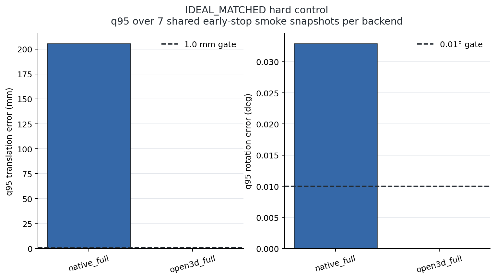
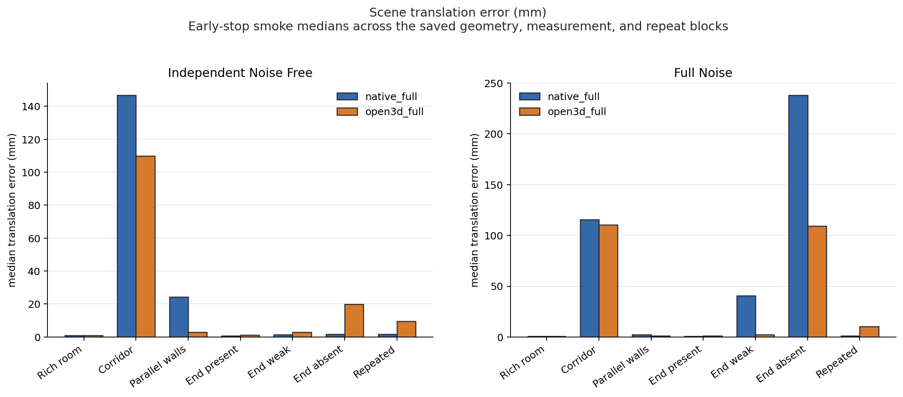
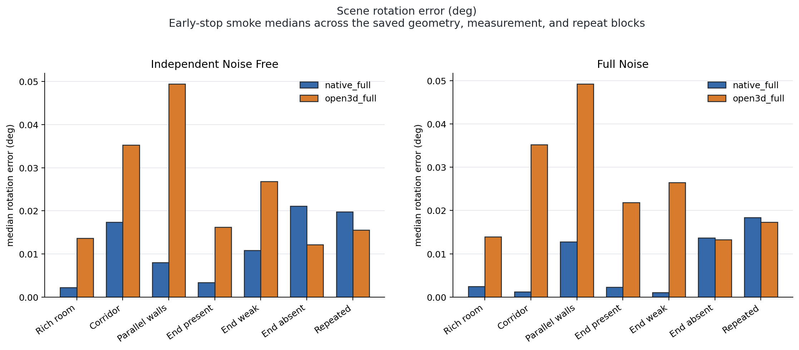
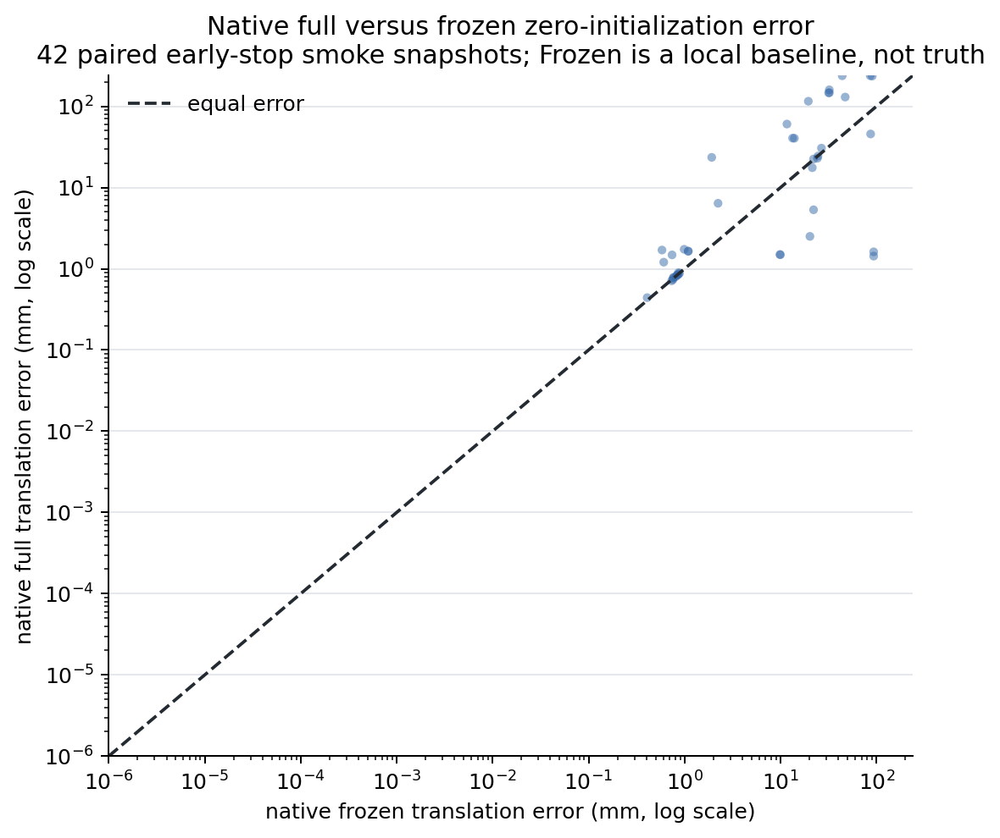
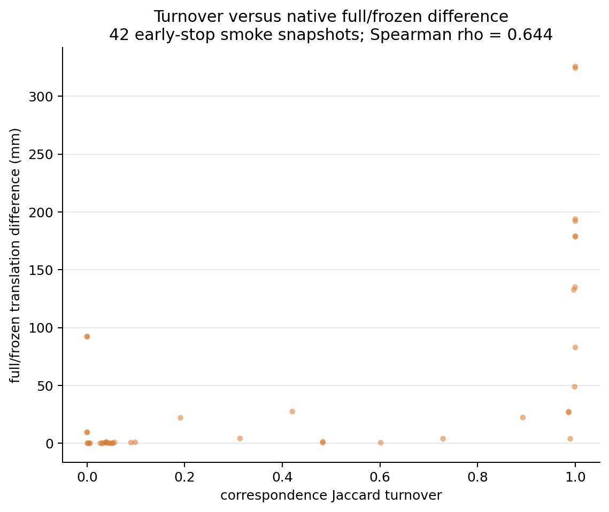
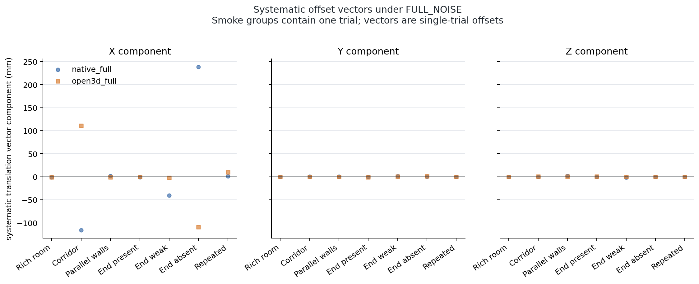
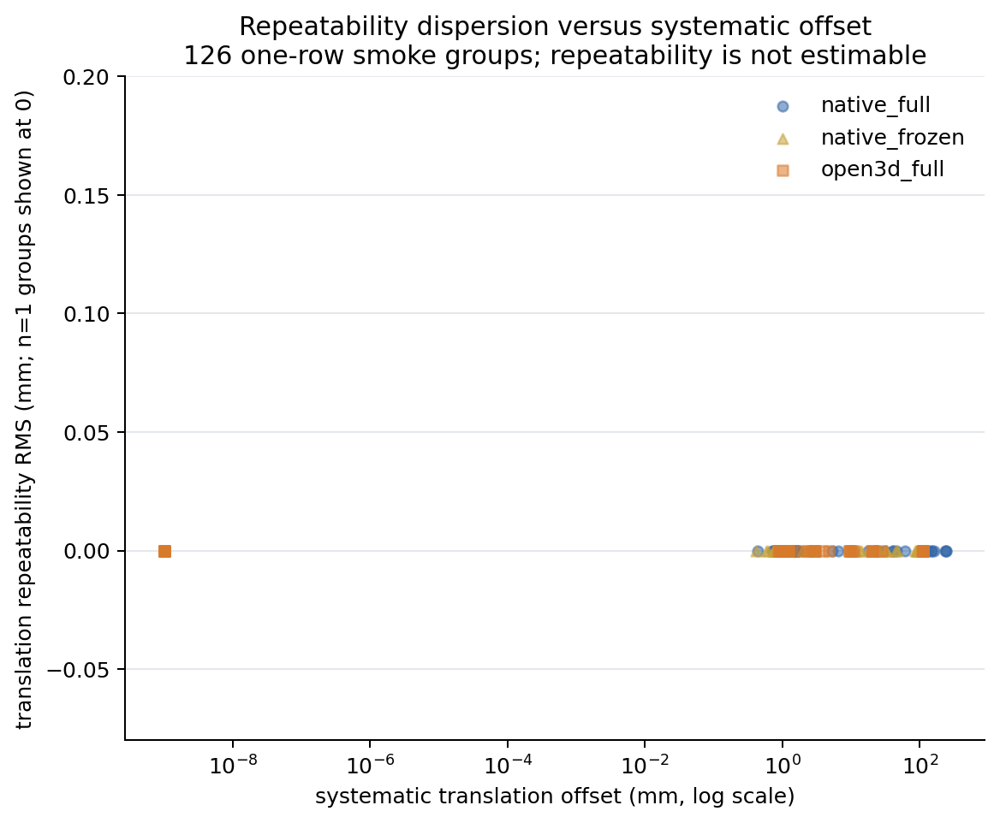
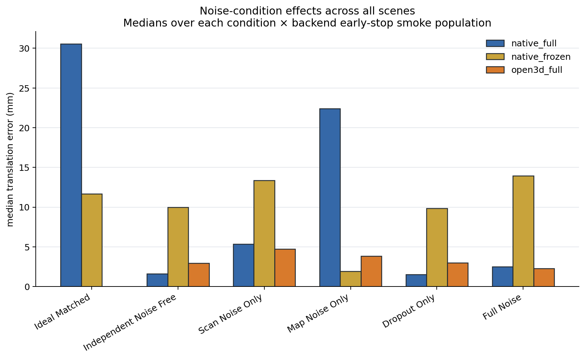
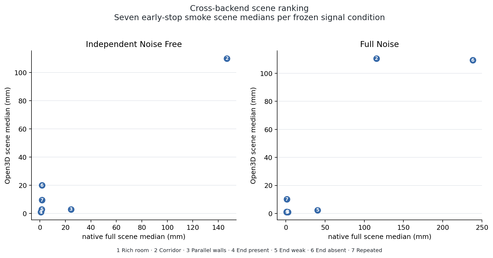

# Zero-Perturbation Registration Measurement — Development

## Technical summary

Development executed the frozen 42-snapshot smoke matrix: 42 independently keyed snapshots and 126 paired backend trials. Snapshot pairing violations, Confirmatory seed instantiations, old capture-range Test-seed accesses, and GT optimization leakage were all zero. The IDEAL_MATCHED hard control is `false`. The smoke failed the first hard gate, so the complete 1260-snapshot / 3780-trial Development matrix was not run, exactly as required by the frozen stopping rule.

The three preliminary engineering signals are: scene effect `false`, cross-backend scene ranking `false`, and reassociation effect `false`. Their evaluation flag is `false` because the hard control must pass first. Consequently, future Confirmatory-lock generation authorization is `false`. Confirmatory execution remains false.

## IDEAL_MATCHED establishes the zero-error control

- `native_full`: q95 translation 0.205393 m; q95 rotation 0.032892°; failures 2; pass `false`.
- `open3d_full`: q95 translation 1.43185e-16 m; q95 rotation 3.98209e-17°; failures 0; pass `true`.

The control chart makes the threshold failure visually explicit; the exact values above remain authoritative. This hard control is evaluated only on native full reassociation and Open3D full ICP; native frozen is reported but does not decide the gate.

## Scene effects and backend agreement remain preliminary

- `INDEPENDENT_NOISE_FREE` / `native_full` / `LONG_CORRIDOR`: weak/rich median ratio `174.5`.
- `INDEPENDENT_NOISE_FREE` / `native_full` / `PARALLEL_WALLS`: weak/rich median ratio `29`.
- `INDEPENDENT_NOISE_FREE` / `open3d_full` / `LONG_CORRIDOR`: weak/rich median ratio `115`.
- `INDEPENDENT_NOISE_FREE` / `open3d_full` / `PARALLEL_WALLS`: weak/rich median ratio `3.082`.
- `FULL_NOISE` / `native_full` / `LONG_CORRIDOR`: weak/rich median ratio `135.6`.
- `FULL_NOISE` / `native_full` / `PARALLEL_WALLS`: weak/rich median ratio `2.943`.
- `FULL_NOISE` / `open3d_full` / `LONG_CORRIDOR`: weak/rich median ratio `126.3`.
- `FULL_NOISE` / `open3d_full` / `PARALLEL_WALLS`: weak/rich median ratio `1.164`.

Cross-backend ranking:

- `INDEPENDENT_NOISE_FREE`: Spearman rho `0.8214`.
- `FULL_NOISE`: Spearman rho `0.7857`.

These are smoke-only descriptive contrasts. They are not evaluated as Development Go/No-Go signals because IDEAL_MATCHED failed, and they are not confirmatory estimates or paper claims. Exact scene × condition × backend summaries and exploratory geometry-block bootstrap calculations are in [noise_condition_summary.csv](tables/noise_condition_summary.csv).

The translation chart shows that weak-scene displacement dominates the rich-room smoke result, while the rotation chart shows a different backend ordering; this divergence is one reason neither chart is promoted to a scientific signal after the hard-gate failure.

## Reassociation changes are measured explicitly

Across all 42 native pairs in this run, correspondence-turnover versus full/frozen translation difference has descriptive Spearman rho `0.6442175301418049`. Because the hard gate failed, this value does not evaluate Signal C. Full and frozen are two algorithms on one snapshot; Frozen is never treated as ground truth. See [turnover_vs_full_frozen_difference.png](figures/turnover_vs_full_frozen_difference.png), [correspondence_turnover.csv](tables/correspondence_turnover.csv), and [full_frozen_comparison.csv](tables/full_frozen_comparison.csv).

The paired endpoint chart shows which snapshots diverge from the equal-error diagonal; the turnover chart then relates that divergence to explicit Jaccard correspondence change rather than a checksum proxy.

## Smoke-only offset and condition diagnostics

The component plot shows the direction of each single-trial smoke offset. The repeatability panel deliberately places all one-row groups at zero and labels repeatability as non-estimable; it must not be read as evidence of perfect repeatability.

The condition chart compares the six frozen realizations without changing backend parameters. The numbered ranking chart avoids label collisions and exposes only descriptive smoke ordering because the prerequisite hard control failed.

## Scope, data, and metric definitions

Every trial begins at `T_initial = T_reference`. Translation error is `||p_estimated - p_reference||`; rotation error is `||Log(R_reference^T R_estimated)||`. A repeated-measurement group fixes scene, geometry seed, condition, and backend, then aggregates one measurement seed × one repeat in this smoke; the frozen full design would use two × five. The norm of the group mean is systematic offset; repeatability RMS is the square root of the covariance trace with `ddof=1`. In this early-stop smoke, one-row groups have zero covariance by definition and do not estimate repeatability. A single-trial displacement is not called bias.

The six frozen conditions and seven frozen synthetic scenes contain no real or visual data. The historical 0.02 m / 0.5° capture-range thresholds are not used.

## Methodology and reproducibility

The native full path rebuilds correspondence search, local planes, residuals, and Jacobians on each nonlinear evaluation. Native frozen retains its initial linearization. Open3D 0.19.0+b012259 independently estimates target-map normals and runs one global point-to-plane parameter set. All three methods consume identical point coordinates and reference initialization for each snapshot, as established by backend-input checksums.

Traditional Hessian metrics use the native initial correspondence system, the native Huber weights, and the unchanged ODI/AIS definitions with the existing ODI pose scaling. Development reports descriptive statistics and Spearman correlations only; no formal p-values or model A/B fitting are performed. The 1000-repetition exploratory bootstrap resamples the outer geometry-seed block using the scheduled Development bootstrap seed.

## Limitations, uncertainty, and robustness checks

- Synthetic Development evidence cannot establish real-data validity, causal mechanism, or Measurement-paper readiness.
- Only one geometry seed underlie the saved exploratory block calculations; in the early-stop smoke the one-block interval collapses and is not an uncertainty estimate.
- Open3D exposes the final correspondence set, fitness, and RMSE but not a portable per-iteration convergence flag; the backend failure contract therefore requires a finite transform/metrics and a non-empty final correspondence set.
- `multi_attractor_summary.csv` is an audit-only endpoint-bin proxy at 1e-4 m/rad and does not authorize a formal multi-attractor claim.
- All nine figures were generated from the saved CSV evidence and are subordinate to exact tables.

## Recommended next step

No Confirmatory lock may be generated from this run. Any future investigation of the native exact-match fixed-point failure must be a separately frozen research route; the locked thresholds, Open3D parameters, and observed Development protocol cannot be changed after this result. This task generated no Confirmatory lock and did not access Confirmatory seeds.

## Further questions

- Will the Development scene ordering and reassociation association persist under the already-frozen Confirmatory split?
- Do real sensor artifacts preserve the same ordering without scene-specific backend tuning? That question remains explicitly unauthorized here.
