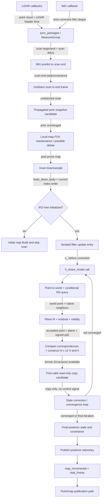

# FAST-LIO2 Point-to-Plane Update Dataflow

## Scope

This is a source-traceable dataflow for FAST-LIO2 commit `7cc4175de6f8ba2edf34bab02a42195b141027e9`, including its pinned IKD-tree submodule commit `e2e3f4e9d3b95a9e66b1ba83dc98d4a05ed8a3c4`. It describes the active point-to-plane update path and the proposed read-only observation boundary. It does not describe an implemented tap.

## End-to-end graph



## Traceable nodes

| Node | Source location | Data read | Data written | Classification | Source SHA-256 |
|---|---|---|---|---|---|
| N01 | `src/laserMapping.cpp::standard_pcl_cbk`, 279–298; `livox_pcl_cbk`, 302–334 | LiDAR message | `lidar_buffer`, `time_buffer`, callback count | READ_WRITE | `edba2d22e98507c86c61126dcca6c2c3ad369e418d0b82f2be9e19f3ee757ac8` |
| N02 | `src/laserMapping.cpp::imu_cbk`, 336–364 | IMU message and time offsets | `imu_buffer`, corrected timestamp | READ_WRITE | `edba2d22e98507c86c61126dcca6c2c3ad369e418d0b82f2be9e19f3ee757ac8` |
| N03 | `src/laserMapping.cpp::sync_packages`, 368–424 | LiDAR/IMU/time buffers | `MeasureGroup`, buffer pops | READ_WRITE | `edba2d22e98507c86c61126dcca6c2c3ad369e418d0b82f2be9e19f3ee757ac8` |
| N04 | `src/IMU_Processing.hpp::UndistortPcl`, 243–303 | scan IMUs, prior state/covariance | propagated filter state/covariance | READ_WRITE | `a456016e268680555919f58ae066354fd297a27f49be197292452f4147e1e0f5` |
| N05 | `src/IMU_Processing.hpp::UndistortPcl`, 307–345 | IMU pose history, raw scan | compensated point coordinates | READ_WRITE | `a456016e268680555919f58ae066354fd297a27f49be197292452f4147e1e0f5` |
| N06 | `src/laserMapping.cpp::main`, 888–901; `esekfom.hpp::get_P`, 1944–1953 | propagated state/covariance and timestamps | collector-owned copies only on Day 3 | READ candidate | FAST main `edba2d22e98507c86c61126dcca6c2c3ad369e418d0b82f2be9e19f3ee757ac8`; IKFoM `b990411209fe06ae64112c8bc807b0c2a13922fc1460ec2745c6701cc9344e85` |
| N07 | `src/laserMapping.cpp::lasermap_fov_segment`, 231–277 | posterior from previous scan, local map bounds | local bounds and possible IKD-tree deletion | READ_WRITE | `edba2d22e98507c86c61126dcca6c2c3ad369e418d0b82f2be9e19f3ee757ac8` |
| N08 | `src/laserMapping.cpp::main`, 903–907 | undistorted scan | `feats_down_body`, `feats_down_size` | READ_WRITE | `edba2d22e98507c86c61126dcca6c2c3ad369e418d0b82f2be9e19f3ee757ac8` |
| N09 | `src/laserMapping.cpp::main`, 908–924 | IKD-tree root and map counts | branch decision and diagnostics | READ | `edba2d22e98507c86c61126dcca6c2c3ad369e418d0b82f2be9e19f3ee757ac8` |
| N10 | `src/laserMapping.cpp::main`, 909–921 | downsampled scan | initial IKD-tree | WRITE | `edba2d22e98507c86c61126dcca6c2c3ad369e418d0b82f2be9e19f3ee757ac8` |
| N11 | `src/laserMapping.cpp::main`, 957–967; `esekfom.hpp::update_iterated_dyn_share_modified`, 1619–1641 | propagated filter and common variance | iteration-local filter state | READ_WRITE | FAST main `edba2d22e98507c86c61126dcca6c2c3ad369e418d0b82f2be9e19f3ee757ac8`; IKFoM `b990411209fe06ae64112c8bc807b0c2a13922fc1460ec2745c6701cc9344e85` |
| N12 | `src/laserMapping.cpp::h_share_model`, 638–754 | current iteration state, scan, post-prune map | formal measurement data and native correspondence caches | READ_WRITE | `edba2d22e98507c86c61126dcca6c2c3ad369e418d0b82f2be9e19f3ee757ac8` |
| N13 | `src/laserMapping.cpp::h_share_model`, 650–672 | current LiDAR point, state, IKD-tree | world point, neighbors, distances, preliminary validity | READ_WRITE | `edba2d22e98507c86c61126dcca6c2c3ad369e418d0b82f2be9e19f3ee757ac8` |
| N14 | `src/laserMapping.cpp::h_share_model`, 674–693; `include/common_lib.h::esti_plane`, 225–257 | neighbors and world point | normalized plane, signed `pd2`, accepted flag | READ_WRITE | FAST main `edba2d22e98507c86c61126dcca6c2c3ad369e418d0b82f2be9e19f3ee757ac8`; common library `8ba52138be2d523fbac056968614c00584dd8a6390866008a4de03f479ec1136` |
| N15 | `src/laserMapping.cpp::h_share_model`, 695–751 | accepted source points and planes | compact rows, `effct_feat_num`, `h_x`, `h` | WRITE | `edba2d22e98507c86c61126dcca6c2c3ad369e418d0b82f2be9e19f3ee757ac8` |
| N16 | proposed boundary after `src/laserMapping.cpp:751`, before 754 | exact formal first-valid J/r, accepted correspondences, variance | collector-owned copy only | READ candidate | `edba2d22e98507c86c61126dcca6c2c3ad369e418d0b82f2be9e19f3ee757ac8` |
| N17 | `esekfom.hpp::update_iterated_dyn_share_modified`, 1643–1927 | formal H/h, common variance, propagated prior | iterated state and covariance | READ_WRITE | `b990411209fe06ae64112c8bc807b0c2a13922fc1460ec2745c6701cc9344e85` |
| N18 | `src/laserMapping.cpp::main`, 960–967 | final filter state | `state_point`, pose fields | READ_WRITE | `edba2d22e98507c86c61126dcca6c2c3ad369e418d0b82f2be9e19f3ee757ac8` |
| N19 | `src/laserMapping.cpp::publish_odometry`, 589–625 | posterior pose and covariance | ROS odometry and transform | READ | `edba2d22e98507c86c61126dcca6c2c3ad369e418d0b82f2be9e19f3ee757ac8` |
| N20 | `src/laserMapping.cpp::map_incremental`, 427–474; `ikd_Tree.cpp::Add_Points`, 478–573 | posterior-transformed scan and cached neighbors | IKD-tree additions and downsample deletions | READ_WRITE | FAST main `edba2d22e98507c86c61126dcca6c2c3ad369e418d0b82f2be9e19f3ee757ac8`; IKD-tree `ec3cbbbb6386eb6c68f9aa081c48b5d62209ada44fe167a002d4e3b112a1ea9f` |
| N21 | `src/laserMapping.cpp`, 478–625 and 979–984 | posterior points/map | ROS point/pose publications | READ | `edba2d22e98507c86c61126dcca6c2c3ad369e418d0b82f2be9e19f3ee757ac8` |

Every node above maps to one or more rows in `manifests/harmful_bias/fastlio2_source_map.csv`.

## Data carried on each major edge

| Edge | Data |
|---|---|
| callbacks → synchronization | preprocessed LiDAR cloud, LiDAR header time, corrected IMU messages |
| synchronization → IMU processing | one `MeasureGroup`: scan, begin/end times, scan IMU deque |
| propagation → prior boundary | scan-end `state_ikfom`, `23 x 23` covariance |
| undistortion → downsampling | points represented in the scan-end LiDAR frame |
| map pruning → measurement model | post-FOV-prune IKD-tree |
| downsampling → measurement model | `feats_down_body`, stable native current-point order |
| query → plane fit | world query point, ordered native neighbor coordinates, squared distances |
| plane fit → compaction | normalized world plane, signed metric distance, accepted flag |
| compaction → J/r | accepted points and planes in serial source-index order |
| J/r → filter | native `H: N x 12`, formal `h: N`, scalar variance `0.001` |
| filter → posterior | corrected 23-DOF state and `23 x 23` covariance |
| posterior → map update | posterior world transforms and cached native neighbors |

## Iterated measurement-model semantics

`update_iterated_dyn_share_modified` copies the propagated state and covariance before entering its loop, then invokes `h_dyn_share(x_, dyn_share)` before applying a correction. With default `max_iteration=4`, the model can be attempted up to five times.

The first valid linearization is the propagated prior. A failed earlier call cannot change state because the filter continues before correction.

Nearest neighbors are not unconditionally recomputed:

- first call: recomputed because `dyn_share.converge=true`;
- later call after a converged correction: recomputed;
- later call after a non-converged correction: cached `Nearest_Points` is reused.

World transforms, plane fits, signed residuals, validity, compaction, Jacobian rows, and formal residual rows are recomputed on every valid callback.

## Prior/posterior boundary

- prior: after `ImuProcess::Process` and before `kf.update_iterated_dyn_share_modified`;
- first valid formal linearization: prior;
- intermediate state: after an iteration `x_.boxplus` but before final return;
- posterior: `kf.get_x()` after the update returns;
- map insertion state: posterior.

The adapter must never use the state read after line 960 as the prior.

## Map query/mutation boundary

The measurement query reads the post-FOV-prune map. Current-scan map deletion at `lasermap_fov_segment` occurs before J/r construction. Post-update `map_incremental` then mutates the map through `Add_Points`, which can also perform downsample deletion and rebuild coordination.

Therefore the read-only design is split:

```text
prior collector start
    after IMU propagation
    before current-scan map pruning

formal observation copy
    after native first-valid J/r is complete
    after current-scan map pruning/query
    before that callback's state correction
    before post-update map insertion

collector finalization
    outside update
    before any next-scan map pruning
```

## Recommended collection point

The formal J/r copy belongs inside `h_share_model` immediately after `ekfom_data.h(i)` has been filled for every accepted row and before the function returns. The collector must select only `FIRST_VALID_LINEARIZATION`, copy existing formal data, and return no estimator control signal.

Prior pose/covariance and scan identity must be copied/reset outside the update after IMU processing and before map pruning. This split is necessary because the native architecture prunes the map before the formal measurement exists.

## Forbidden collection points

Do not collect detector input:

- after `x_.boxplus`, because that is an intermediate or final corrected state;
- from `state_point = kf.get_x()` after the update, because that is posterior;
- after `map_incremental`, because the map has changed;
- by calling `Nearest_Search` again;
- by rebuilding residuals or Jacobians in a second code path;
- from ROS pose/map publications;
- from every iteration as if each were a separate scan.

## Confirmed inactive/exception nodes

- `publish_map` exists, but its main-loop call is commented out.
- initial map build mutates the map and skips the scan; it has no formal LiDAR update record.
- no source-semantic node required by the Day 3 read-only contract remains unresolved.
