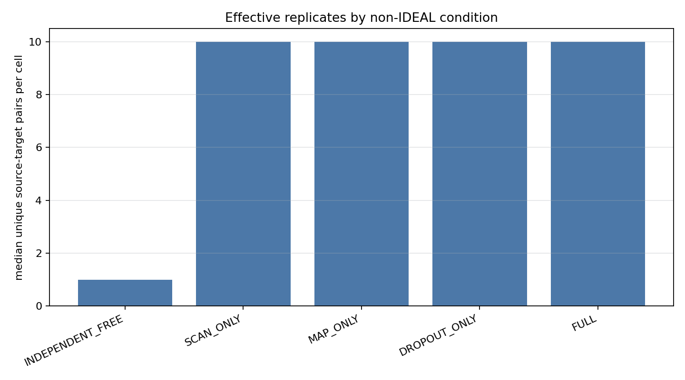
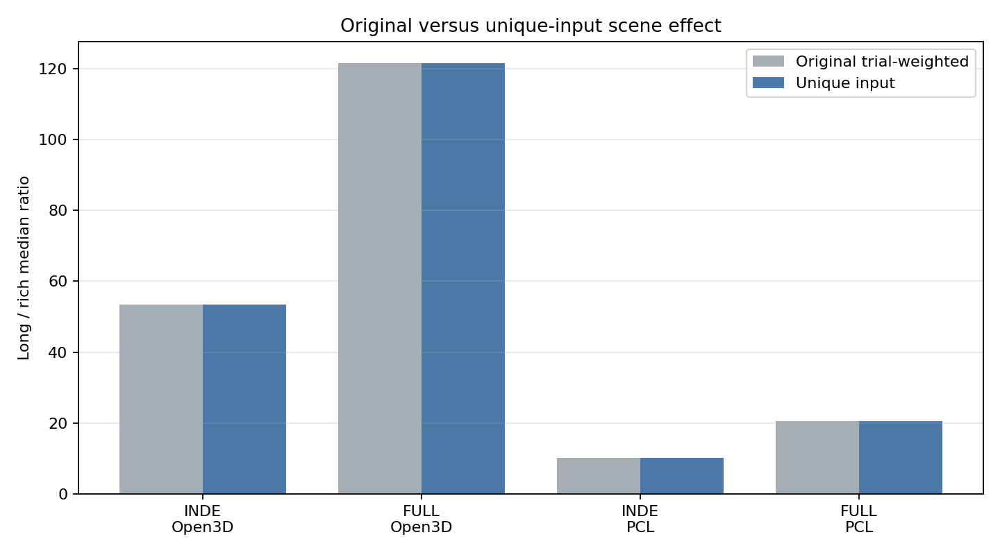
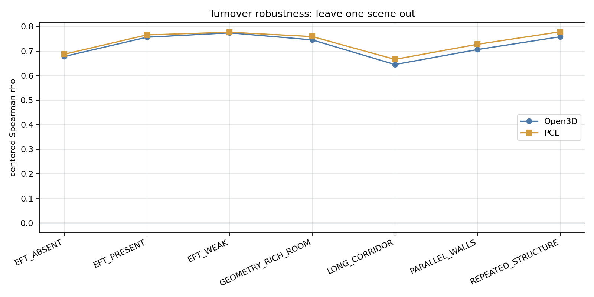
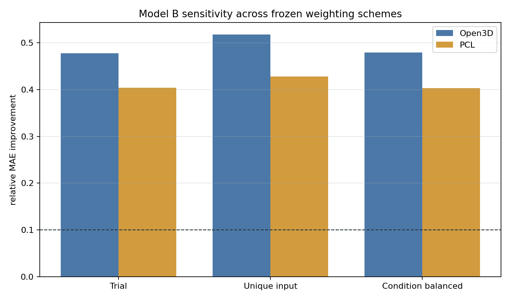
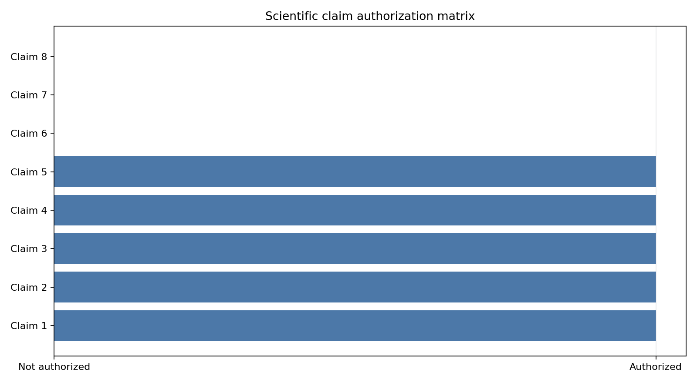

# Zero-Perturbation Scientific Survival Audit

## Decision

`SCIENTIFIC_SURVIVAL_AUDIT_PASS = true`. All nine frozen survival gates are conjunctive; none was relaxed.

| Gate | Result |
|---|---:|
| `RAW_EVIDENCE_INTEGRITY_PASS` | `true` |
| `ARTIFACT_PUBLICATION_PASS` | `true` |
| `REPLICATE_UNIQUENESS_AUDIT_PASS` | `true` |
| `PRIMARY_SCENE_EFFECT_UNIQUE_UNIT_PASS` | `true` |
| `CROSS_BACKEND_UNIQUE_UNIT_PASS` | `true` |
| `REASSOCIATION_ROBUSTNESS_PASS` | `true` |
| `MODEL_DATA_LEAKAGE_AUDIT_PASS` | `true` |
| `MODEL_INCREMENTAL_VALUE_ROBUST_PASS` | `true` |
| `CLAIM_WORDING_BOUNDARY_PASS` | `true` |

## Replicate uniqueness changes the wording, not the frozen evidence

The audit found 21 deterministic-single-input cells, 0 partial cells, and 84 fully replicated cells. Pseudoreplication risk is therefore identified. INDEPENDENT_NOISE_FREE is described only as deterministic zero-initialization displacement; repeatable systematic offset is restricted to FULL_NOISE where its stricter gate passes.

## Unique-input scene and cross-backend effects survive

All four Long Corridor versus Geometry Rich Room backend × primary-condition comparisons retain ratio ≥ 5, absolute difference ≥ 0.005 m, and at least 2/3 geometry-level wins after collapsing duplicate inputs.

The five-condition unique-input Spearman median is `0.9642857143` and the pooled 35-cell rho is `0.9554621849`.

## Turnover association survives stress tests but is not causal

- Open3D: pooled rho `0.8162478742`, centered rho `0.7249110498`, positive LOSO `7/7`, positive LOCO `5/5`, unique-input rho `0.8188573551`.
- PCL: pooled rho `0.7887850028`, centered rho `0.7399111623`, positive LOSO `7/7`, positive LOCO `5/5`, unique-input rho `0.7931647036`.

## Model B remains explanatory under three weighting schemes

The geometry-fold, train-only-scaler leakage audit passes. Model B uses post-registration turnover, normal-change, and residual-change diagnostics, so it supports incremental explanatory value only—not pre-registration prediction.

- open3d_point_to_plane / ORIGINAL_TRIAL_WEIGHTED: MAE A `0.5326584657`, MAE B `0.2785631055`, relative improvement `0.4770324262`, B-better folds `3/3`.
- open3d_point_to_plane / UNIQUE_INPUT_WEIGHTED: MAE A `0.5192529695`, MAE B `0.2505718345`, relative improvement `0.5174378402`, B-better folds `3/3`.
- open3d_point_to_plane / UNIQUE_INPUT_CONDITION_BALANCED: MAE A `0.5340200485`, MAE B `0.2782124992`, relative improvement `0.4790223701`, B-better folds `3/3`.
- pcl_point_to_plane / ORIGINAL_TRIAL_WEIGHTED: MAE A `0.5095596606`, MAE B `0.3037709189`, relative improvement `0.4038560302`, B-better folds `3/3`.
- pcl_point_to_plane / UNIQUE_INPUT_WEIGHTED: MAE A `0.495341569`, MAE B `0.283271913`, relative improvement `0.4281281226`, B-better folds `3/3`.
- pcl_point_to_plane / UNIQUE_INPUT_CONDITION_BALANCED: MAE A `0.5089765457`, MAE B `0.3037385932`, relative improvement `0.4032365622`, B-better folds `3/3`.

## Claim authorization boundary

- Claim 1: `true` — Scene-dependent zero-initialization registration displacement. Required: “scene-dependent zero-initialization registration displacement”; forbidden: “universal environment-intrinsic failure”.
- Claim 2: `true` — Cross-backend reproducibility of scene ranking. Required: “cross-backend reproducibility of scene ranking”; forbidden: “backend-independent universal ranking”.
- Claim 3: `true` — Association turnover is statistically associated with displacement. Required: “association turnover is statistically associated with displacement”; forbidden: “association turnover causes displacement”.
- Claim 4: `true` — Reassociation diagnostics provide incremental explanatory value. Required: “incremental explanatory value”; forbidden: “pre-registration failure prediction”.
- Claim 5: `true` — Repeatable systematic offset under FULL_NOISE. Required: “repeatable systematic offset under FULL_NOISE”; forbidden: “universal systematic bias”.
- Claim 6: `false` — Systematic bias under INDEPENDENT_NOISE_FREE. Required: “DETERMINISTIC_ZERO_INITIALIZATION_DISPLACEMENT”; forbidden: “repeatable systematic bias from duplicated deterministic inputs”.
- Claim 7: `false` — Causal effect of reassociation. Required: “association only; no causal claim”; forbidden: “reassociation causes registration error”.
- Claim 8: `false` — Universal environment-intrinsic localizability. Required: “scene-dependent synthetic Development result”; forbidden: “universal environment-intrinsic localizability”.

## Protocol-design boundary

- `CONFIRMATORY_SEED_PROVENANCE_PASS = true`
- `SYNTHETIC_CONFIRMATORY_PROTOCOL_READY = true`
- `REAL_DATA_PROTOCOL_FRAMEWORK_READY = true`
- `CONFIRMATORY_RUN_AUTHORIZED = false`
- `REAL_DATA_RUN_AUTHORIZED = false`
- `MEASUREMENT_PAPER_MAINLINE_AUTHORIZED = false`

## Audit table registry

- [`replicate_uniqueness_by_cell.csv`](tables/replicate_uniqueness_by_cell.csv)
- [`replicate_uniqueness_by_condition.csv`](tables/replicate_uniqueness_by_condition.csv)
- [`measurement_seed_effectiveness.csv`](tables/measurement_seed_effectiveness.csv)
- [`repeat_index_effectiveness.csv`](tables/repeat_index_effectiveness.csv)
- [`unique_unit_scene_effect.csv`](tables/unique_unit_scene_effect.csv)
- [`cross_backend_unique_unit.csv`](tables/cross_backend_unique_unit.csv)
- [`turnover_robustness.csv`](tables/turnover_robustness.csv)
- [`model_leakage_audit.csv`](tables/model_leakage_audit.csv)
- [`model_weighting_sensitivity.csv`](tables/model_weighting_sensitivity.csv)
- [`model_fold_results.csv`](tables/model_fold_results.csv)
- [`counterexample_review_shortlist.csv`](tables/counterexample_review_shortlist.csv)
- [`scientific_claim_authorization.csv`](tables/scientific_claim_authorization.csv)
- [`gate_summary.csv`](tables/gate_summary.csv)

## Figure registry

- [`effective_replicates_by_condition.png`](figures/effective_replicates_by_condition.png)
- [`original_vs_unique_weighted_effect.png`](figures/original_vs_unique_weighted_effect.png)
- [`turnover_leave_one_scene_out.png`](figures/turnover_leave_one_scene_out.png)
- [`model_weighting_sensitivity.png`](figures/model_weighting_sensitivity.png)
- [`claim_authorization_matrix.png`](figures/claim_authorization_matrix.png)

## Remaining limitation

This remains synthetic Development evidence over three Development geometry seeds. Correlation is not causation; the automatic shortlist is not human validation; Confirmatory and real-data runs remain unauthorized.
